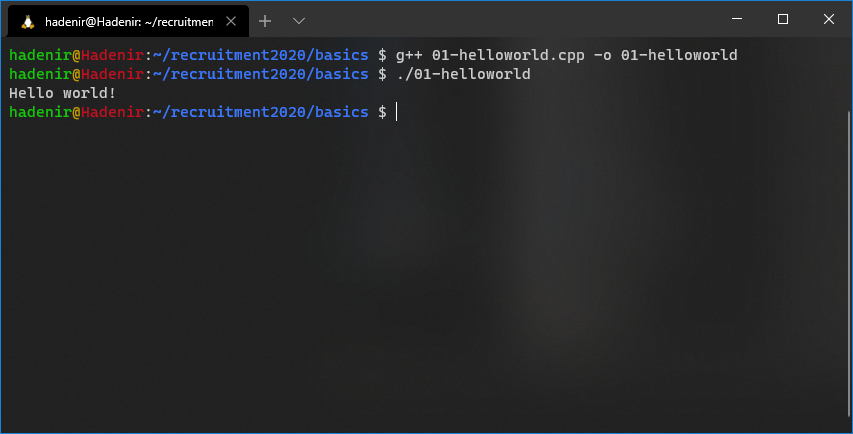
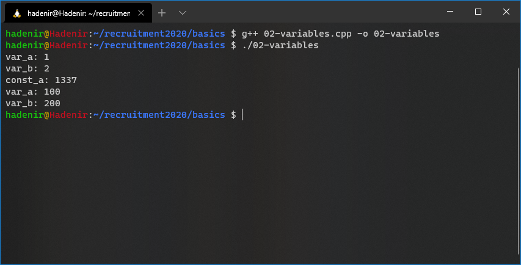
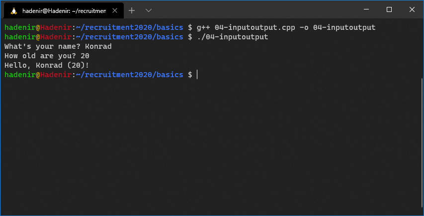
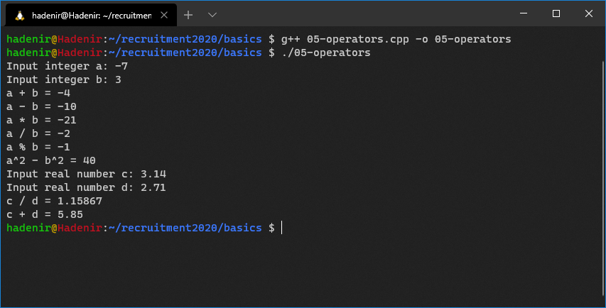
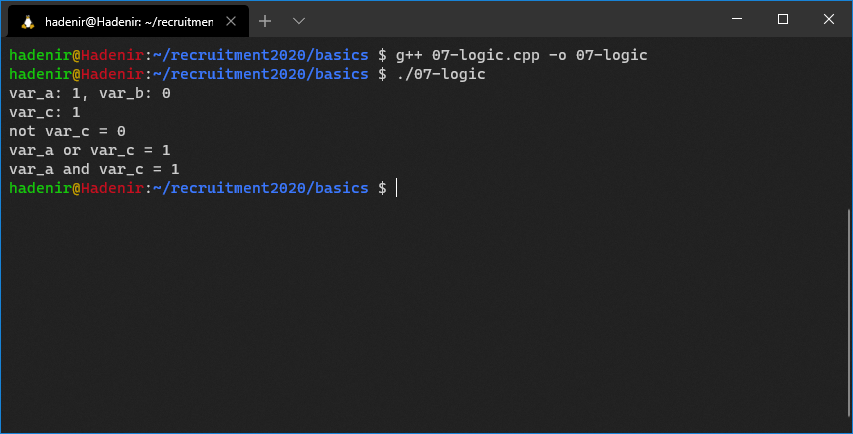
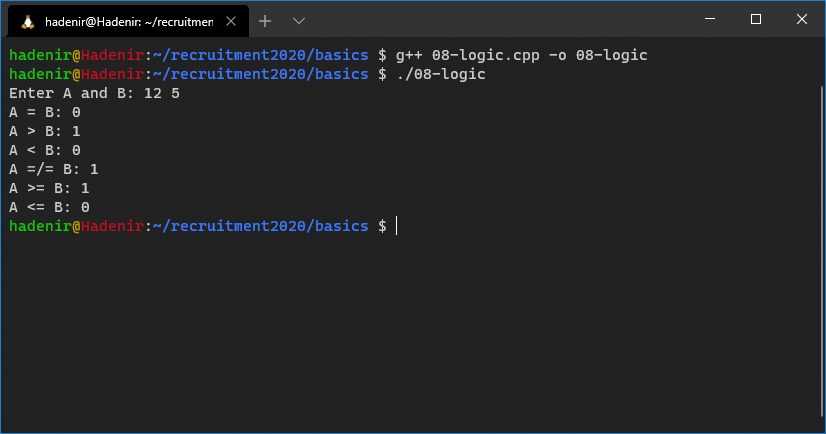
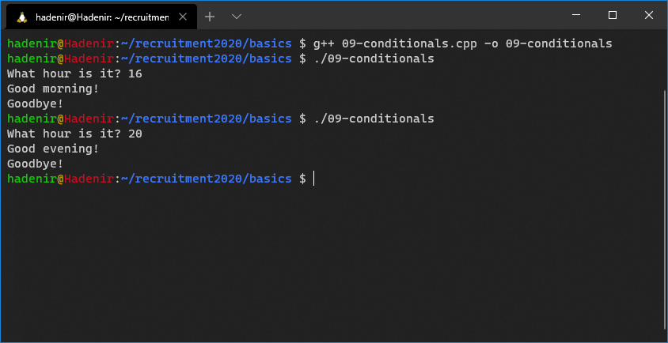
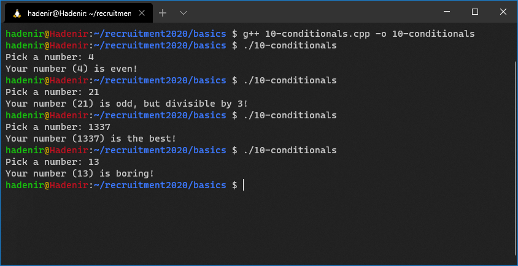
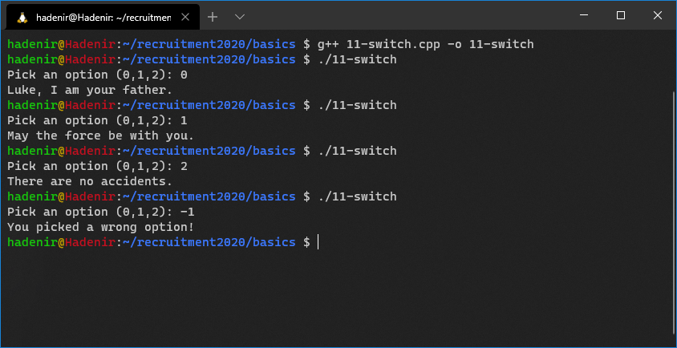
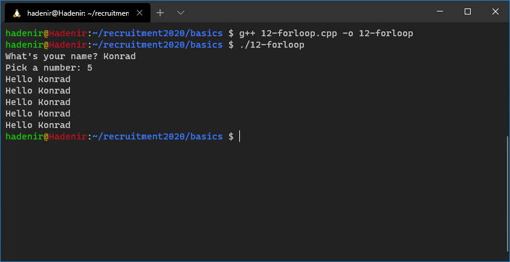

# Szkolenie z podstaw programowania C++
### *SKA Robotics*
### Konrad Brzózka

# Wstęp
W najbliższy piątek, tj. **27.11.2020 o 18:00**, widzimy się na szkoleniu z programowania w C++. Zakładamy, że jest to Wasze pierwsze spotkanie z jakimkolwiek językiem programowania, dlatego zaczniemy od samych podstaw. Ten tutorial ma na celu zapoznanie Was z częścią najprostszych zagadnień, aby na wykładzie móc skupić się na bardziej złożonych rzeczach. Jeśli ktoś już trochę programował w C++, to nie znajdzie tutaj nic ciekawego dla siebie. Kod wszystkich przykładów jest dostępny na GitHubie, skompilowane programy do samodzielnego przetestowania możecie ściągnąć [tutaj](). Jeśli macie jakiekolwiek pytania, śmiało piszcie do mnie, najłatwiej złapać mnie na discordzie ;)

# Struktura kodu
Kod C++ zapisujemy w plikach z rozszerzeniem `.cpp`. Przykładowy program wypisujący na konsolę tekst `"Hello world!"` wygląda następująco:
```cpp
#include <iostream>

int main()
{
    std::cout << "Hello world!" << std::endl;

    return 0;
}
```
Powyższy kod znajduje się w pliku `01-helloworld.cpp`. Opiszmy teraz, co oznaczają kolejne części programu:
* `#include <iostream>` - dołączenie do naszego kodu nagłówka biblioteki `iostream` pozwalającego na wysyłanie/odbieranie danych z konsoli (więcej o nagłówkach powiemy na drugiej części szkolenia);
* `int main()` - definicja funkcji `main()`, która jest punktem wejściowym programu, to znaczy, że kod wewnątrz tej funkcji jest wykonywany jako pierwszy przy uruchamianiu programu (więcej o funkcjach na najbliższym szkoleniu);
* `{`...`}` - po definicji funkcji, w nawiasach klamrowych, podajemy ciało tej funkcji, tj. listę instrukcji które program ma wykonać po jej wywołaniu (kod zawarty w klamrach nazywamy blokiem). Kolejne instrukcje kodu są wykonywane pojedyczno, jedna po drugiej;
* `std::cout` - obiekt reprezentujący standardowy strumień wyjściowy. Używamy go do wysyłania danych, które mają zostać wyświetlone na konsolę;
* `<< "Hello world!"` - przekazanie tekstu `"Hello world!` do strumienia wyjściowego za pomocą operatora `<<`. W ten sposób możemy wypisywać tekst na konsolę w C++;
* `<< std::endl` - przekazanie *zakończenia linii* do strumienia wyjściowego, aby wszystko co zostanie wypisane od teraz na konsolę, pojawiało się w kolejnej linii;
* `;` - w C++ każda instrukcja kończy się średnikiem. Bezpośrednio po nim może pojawić się kolejna instrukcja, ale dobrą praktyką jest pisanie tylko 1 instrukcji w linii;
* `return 0;` - zwrócenie z funkcji wartości 0. Jest to informacja dla systemu operacyjnego, że nasz program zakończył się pomyślnie (wartości inne niż 0 oznaczają, że wydarzył się błąd).

Podsumowując, program rozpoczyna swoje działanie w funkcji `main()`, po czym przekazuje do konsoli tekst `"Hello world!"` oraz informację o końcu linii. Następnie finalizuje swoje działanie sygnalizując pomyślne zakończenie.
<!---
Jeśli ktoś nie rozumie dokładnie jak to działa, może pomóc sobie następującą analogią:
> O dowolnym programie możemy myśleć jak o rozmowie z komputerem, który nie jest niestety szczególnie bystrym rozmówcą, ale za to ma dobrą pamięć i szybko liczy oraz zwykle nas słucha (jest trochę jak stereotypowy mężczyzna i słabo idzie mu domyślanie się, o co nam chodziło 😅) Więc komunikaty dla niego muszą być jasne i bezbłędne.
Każdy program składa się z podstawowych, koniecznych elementów:
> * `#include <iostream>` mówi, że komputer ma być gotowy do pisania w konsoli oraz czytania z niej, dzięki temu rozumie, że `std::cout` to nie jest jakiś niezrozumiały bełkot, ale konkretne polecenie. Możnaby się zastanawiać, czy to nie jest bez sensu, że trzeba za każdym razem deklarować tego typu funkcjonalność, jednak aby to zrozumieć wystarczy pomyśleć, że istnieje mnóstwo bibliotek zawierających przeróżne funkcje, których nie da się wszystkich zapamiętać;
> *
-->

Wiemy teraz jak wygląda prosty program w C++, ale jak go uruchomić?

# Kompilacja
W SKAR pracujemy na Linuxie, dlatego zaprezentuję Wam jak przebiega proces kompilacji w tym środowisku. Wszystkie przykłady na szkoleniu będą kompilowane za pomocą kompilatora GNU GCC, który wywołuje się w następujący sposób:
```bash
$ g++ <source_file> -o <output_file>
```
* `<source_file>` - nazwa pliku `.cpp` z kodem programu
* `<output_file>` - nazwa pliku wynikowego

Po udanym procesie kompilacji, możemy uruchomić nasz program komendą:
```bash
$ ./<output_file>
```

W naszym przypadku komendy będą wyglądać tak:


Jak widać program poprawnie wypisał ciąg `"Hello world!"`, skończył linię i zakończył działanie.

# Zmienne i stałe
Programy komputerowe oprócz wykonywania poleceń muszą też operować na pewnych danych. Służą do tego zmienne i stałe. Zmienna (lub stała) ma swoją unikalną nazwę i może przyjmować wartości okreslonego typu. Zmienne (i stałe) w informatyce są bardzo podobne do tych w matematyce, ale są między nimi pewne różnice. W C++ tworzenie zmiennej ma następującą składnię:
```cpp
<typ> <nazwa_zmiennej>;
```

Omówmy przykład z pliku `02-variables.cpp`:
```cpp
#include <iostream>

int main()
{
    int var_a;
    var_a = 1;

    int var_b = 2;

    const int const_a = 1337;

    std::cout << "var_a: " << var_a << std::endl;
    std::cout << "var_b: " << var_b << std::endl;
    std::cout << "const_a: " << const_a << std::endl;

    var_a = 100;
    var_b = 200;

    std::cout << "var_a: " << var_a << std::endl;
    std::cout << "var_b: " << var_b << std::endl;

    // const_a = 7331; <-- BLAD!

    return 0;
}
```
* `int var_a;` - deklaracja zmiennej o nazwie `var_a`, która może przyjmować wartości typu `int` (*integer*, ang. liczba całkowita). Po stworzeniu zmienna ma wartość *niezdefiniowaną*, czyli praktycznie losową;
* `var_a = 1;` - inicjalizacja, tj. przypisanie wartości zmiennej `var_a`. Od tej linijki ma ona wartość 1;
* `int var_b = 2;` - deklarację i inicjalizację zmiennej można połączyć w jedną instrukcję. Dzięki temu unikamy etapu, w którym zmienna posiada *losową* wartość;
* `const int const_a = 1337;` - jeśli typ poprzedzimy słowem `const` to deklarujemy stałą. Od zmiennej różni się tym, czym wskazują ich nazwy - zmienna może zmieniać swoją wartość, natomiast jeśli przypiszemy wartość do stałej, nie możemy jej już potem zmienić;
* Kolejne 3 linijki wypisują wartości zmiennych i stałej na konsolę, tak jak w poprzednim przykładzie;
* `var_a = 100; var_b = 200;` - przypisanie wartości do zmiennych, od tej linijki będą posiadały nowe wartości;
* `const_a = 7331;` - ta instrukcja wywołałaby błąd kompilatora, gdyż wartości stałych nie mogą być zmieniane;
* Tekst po `//` jest traktowany jako komentarz, to znaczy że kompilator go zignoruje (komentarzami jest tez tekst pomiędzy `/*` a `*/`);
* `return 0;` - nasz program zawsze kończy się pomyślnie, dlatego zwracamy 0.

Teraz możemy skompilować i uruchomić nasz program:


# Typy danych
W poprzednim przykładnie poznaliśmy jeden z typów danych: `int`. Służy on do przechowywania liczb całkowitych i jest najczęściej stosowanym typem we wszystkich programach. Właściwie w C++ istnieje 5 różnych typów całkowitoliczbowych, a `int` jest jednym z nich. Po co ich aż tyle? Pamięć komputera jest ograniczona, zatem nie da się w niej zapisać liczb o dowolnej wielkości. C++ udostępnia rózne typy danych, które różnią się zakresami liczb jakie są w stanie reprezentować. Niestety standard nie precyzuje jakie to zakresy, a jedynie który typ ma szerszy przedział od poprzedniego. Kolejność (rosnąco) jest następująca: `char`, `short`, `int`, `long` i `long long`. Każdy z tych typów, z wyjątkiem `char`, ma odpowiadający sobie *typ bez znaku*, czyli taki, który pozwala na reprezentowanie jedynie liczb *nieujemnych*: `unsigned short`, `unsigned int`, `unsigned long` oraz `unsigned long long`. Typ `char` jest szczególnym przypadkiem, gdyż występuje w 3 wersjach:
* `char` - służący do reprezentowania pojedynczych znaków, takich jak `'A'`, `'Z'`, `' '`, `'$'` (każdy znak ma przypisany kod z zakresu 0-255);
* `signed char` - reprezentujący liczby całkowite ze znakiem (-128 do 127);
* `unsigned char` - reprezentujący liczby całkowite bez znaku (0 do 255).

Poniższa tabela przedstawia rozmiary (w bajtach) i zakresy typów całkowitoliczbowych, które występują obecnie w najpopularniejszych kompilatorach:
Typ danych           | Windows (64-bit) | Rozmiar | Linux (64-bit) | Rozmiar |
---------------------|------------------|---------|----------------|---------|
`signed char`        | -128 -- 127      | 1       | -128 -- 127    | 1       |
`unsigned char`      | 0 -- 255         | 1       | 0 -- 255       | 1       |
`short`              | -32768 –- 32767  | 2       | -32768 – 32767 | 2       |
`unsigned short`     | 0 –- 65535       | 2       | 0 –- 65535     | 2       |
`int`                | -2³¹ -- 2³¹-1    | 4       | -2³¹ -- 2³¹-1  | 4       |
`unsigned int`       | 0 -- 2³²-1       | 4       | 0 -- 2³²-1     | 4       |
`long`               | -2³¹ -- 2³¹-1    | 4       | -2⁶³ -- 2⁶³-1  | 8       |
`unsigned long`      | 0 -- 2³²-1       | 4       | 0 -- 2⁶⁴-1     | 8       |
`long long`          | -2⁶³ -- 2⁶³-1    | 8       | -2⁶³ -- 2⁶³-1  | 8       |
`unsigned long long` | 0 -- 2⁶⁴-1       | 8       | 0 -- 2⁶⁴-1     | 8       |

Zwróćcie uwagę na przypadek typu `long` (i `unsigned long`), którego rozmiar nie pokrywa się pomiedzy Linuxem i Windowsem!

Oprócz typów całkowitoliczbowych C++ oferuje też 2 typy zmiennoprzecinkowe, pozwalające na zapisywanie liczb rzeczywistych: `float` oraz `double`. Ich działanie wykracza poza zakres naszego szkolenia, jeśli ktoś chce może więcej poczytać [tutaj](https://en.wikipedia.org/wiki/Floating-point_arithmetic#Floating-point_numbers). Jak sama nazwa wskazuje typ `double` jest dwa razy dokładniejszy niż typ `float`, mimo to w większości przypadków `float` zapewnia wystarczającą precyzję. Typy zmiennoprzecinkowe nie posiadają odpowiedników *bez znaku*!

Przykład `03-datatypes.cpp`:
```cpp
#include <iostream>

int main()
{
    char var_ch = 'b';

    short var_sh = -1024;
    unsigned short var_ush = 65535;

    int var_i = 100;
    unsigned int var_ui = 1500000;

    long var_l = -2123456789;
    unsigned long var_ul = 4294967296;

    long long var_ll = 9223372036854775808;
    unsigned long long var_ull = 18446744073709551616;

    signed char var_sch = -127;
    unsigned char car_uch = 255;

    float var_f = 1.2345;
    double var_d = 4.5678;
}
```

# Standardowe wejście i wyjście
Najbardziej podstawowym sposobem na komunikowanie się programu ze światem zewnętrznym (np. z użytkownikiem) jest konsola. W C++ realizowane jest to za pomocą tzw. standardowych strumieni wejścia i wyjścia. Strumień wyjściowy poznaliśmy już w pierwszym przykładzie: `std::cout` (`cout` to skrót od `console output`). Służył do wyświetlania informacji na konsoli. Odpowiadający mu strumień wejściowy nazywa się `std::cin` (skrót od `console input`) i służy do pobierania informacji za pomocą konsoli.

Spójrzmy na kolejny przykład, z pliku `04-inputoutput.cpp`:
```cpp
#include <iostream>
#include <string>

int main()
{
    std::cout << "What's your name? ";

    std::string name;
    std::cin >> name;

    std::cout << "How old are you? ";

    unsigned int age;
    std::cin >> age;

    std::cout << "Hello, " << name << " (" << age << ")!" << std::endl;

    return 0;
}
```
* `#include <iostream>` - zapewnia nam dostęp do `std::cout` i `std::cin`;
* `#include <string>` - dołącza bibliotekę, która definiuje nowy typ danych: `std::string`, pozwalający reprezentować ciągi znaków;
* `std::cout << "What's your name? ";` - to już znamy;
* `std::string name;` - tworzymy zmienną `name` typu `std::string`;
* `std::cin >> name;` - wczytujemy do zmiennej `name` dane ze strumienia wejściowego. W tym momencie program zatrzyma się, oczekując aż użytkownik wpisze coś w konsoli;
* Analogicznie wczytujemy dane do zmiennej `age`;
* `std::cout << "Hello, " << name << " (" << age << ")!" << std::endl;` - na koniec program wypisuje wiadomość, skonstruowane z użyciem podanych informacji.

Zwróćcie uwagę na kierunek operatorów `<<` i `>>` przy strumieniach! Uruchomienie programu może wyglądać tak:


Na początku tutoriala jest link do skompilowanych przykładow, jesli ktoś chce się sam pobawić.

# Operacje arytmetyczne
Wiemy już jak wyświetlać, wczytywać i przechowywać dane w C++. Teraz pokażemy, jak wykonywać na nich operacje arytmetyczne.

Spójrzmy na przykład `05-operators.cpp`:
```cpp
#include <iostream>

int main()
{
    std::cout << "Input integer a: ";
    int a;
    std::cin >> a;

    std::cout << "Input integer b: ";
    int b;
    std::cin >> b;

    int sum = a + b;
    std::cout << "a + b = " << sum << std::endl;

    int diff = a - b;
    std::cout << "a - b = " << diff << std::endl;

    std::cout << "a * b = " << a * b << std::endl;
    std::cout << "a / b = " << a / b << std::endl;
    std::cout << "a % b = " << a % b << std::endl;

    int result = (a + b) * (a - b);
    std::cout << "a^2 - b^2 = " << result << std::endl;

    std::cout << "Input real number c: ";
    float c;
    std::cin >> c;

    std::cout << "Input real number d: ";
    float d;
    std::cin >> d;

    float ratio = c / d;
    std::cout << "c / d = " << ratio << std::endl;
    std::cout << "c + d = " << c + d << std::endl;

    return 0;
}
```

C++ oferuje wszystkie podstawowe operacje arytmetyczne:
* `+` - dodawanie;
* `-` - odejmowanie;
* `*` - mnożenie;
* `/` - dzielenie (UWAGA: Jeśli dzielimy liczby całkowite wykonywane jest tzw. dzielenie całkowite, czyli w wyniku pomijana jest część ułamkowa);
* `%` - obliczanie reszty z dzielenia (tylko dla typów całkowitoliczbowych).

Zachowana jest kolejność wykonywania działań, jeśli chcemy narzucić inną używamy nawiasów `(`...`)`. Zwróćcie uwagę, że do zmiennych, oprócz wartości wprost (np. `int a = 2;`), można przypisywać wartości będące wynikiem operacji np. `int a = 1 + 1;` lub `int sum = a + b;`.

Przykładowe uruchomienie programu:


# Typ logiczny
Oprócz typów liczbowych (całkowitych i zmiennoprzecinkowych) w C++ mamy też typ logiczny `bool`. Zmienne tego typu mogą przyjmować jedną spośród tylko 2 wartości: `true` albo `false`. Co wiecej, mamy do dyspozycji 3 operacje, które można na nich wykonywać:
* `!` - negacja (zmiana `false` na `true`, lub `true` na `false`);
* `&&` - koniukcja (logiczny *and*)
* `||` - alternatywa (logiczny *or*)

Ich zastosowanie przedstawia przykład z pliku `07-logic.cpp`:
```cpp
#include <iostream>

int main()
{
    bool var_a = true;
    bool var_b = false;

    std::cout << "var_a: " << var_a << ", var_b: " << var_b << std::endl;

    std::cout << "var_c: ";
    bool var_c;
    std::cin >> var_c;

    std::cout << "not var_c = " << !var_c << std::endl;
    std::cout << "var_a or var_c = " << (var_a || var_c) << std::endl;
    std::cout << "var_a and var_c = " << (var_a && var_c) << std::endl;

    return 0;
}
```
Uwaga:
* Wartości typu `bool` można wczytywać bezpośrednio z konsoli, wtedy 1 oznacza `true`, a 0 oznacza `false`;
* `!var_c` - nie zmienia wartosci zmiennej `var_c` (można to zrobić tak: `var_c = !var_c;`).

Przykładowe uruchomienie programu:


Wartości logiczne możemy też otrzymywać za pomocą operatorów porównania:
* `==` - równy (Uważajcie, żeby nie pomylić `=` z `==`)
* `!=` - różny
* `>` - większy
* `<` - mniejszy
* `>=` - większy lub równy
* `<=` - mniejszy lub równy

I kolejny przykład prezentujący nowe operatory (`08-logic.cpp`):
```cpp
#include <iostream>

int main()
{
    std::cout << "Enter A and B: ";
    int a;
    int b;
    std::cin >> a >> b;

    bool equal = a == b;
    bool a_greater = a > b;
    bool b_greater = a < b;
    std::cout << "A = B: " << equal << std::endl
              << "A > B: " << a_greater << std::endl
              << "A < B: " << b_greater << std::endl;

    std::cout << "A =/= B: " << (a != b) << std::endl
              << "A >= B: " << (a >= b) << std::endl
              << "A <= B: " << (a <= b) << std::endl;

    return 0;
}
```
Uwaga:
* `std::cin >> a >> b;` - jeśli chcemy wczytać kilka wartości ze standardowego wejscia możemy zrobić to jedną instrukcją.

Przykładowe uruchomienie programu:


# Instrukcje warunkowe
Do tej pory wszystkie nasze przykładowe programy działały zawsze tak samo, bez względu na to jakie dane zostały wprowadzone przez użytkownika (zmieniały się tylko wartości zmiennych, ale zawsze był wykonywany ten sam kod). Instrukcje warunkowe pozwalają programowi na wykonywanie fragmentów kodu w zależności od pewnych warunków. Pierwszą instrukcją warunkową jaką poznamy jest instrukcja `if`:
```cpp
if(<warunek>)
{
    ...
}
```
* Instrukcja `if` przyjmuje w nawiasach warunek - wartość typu `bool` (zmienną albo wyrażenie np. porównanie);
* Jeśli wartośc w nawiasie jest równa `true` kod w nawiasach klamrowych za `if` zostanie wykonany;
* W przeciwnym wypadku cały blok zostaje pominięty.

```cpp
if(<warunek>)
{
    ...
}
else
{
    ...
}
```
* Opcjonalnie możemy też napisać słowo kluczowe `else` i dodać kolejny blok kodu. Wykona się on tylko wtedy, gdy warunek `if` nie będzie spełniony (będzie równy `false`);
* Zatem zawsze wykona się jeden z dwóch bloków (ten za `if` *albo* ten za `else`).

Przykład `09-conditionals.cpp`:
```cpp
#include <iostream>

int main()
{
    std::cout << "What hour is it? ";
    int hour;
    std::cin >> hour;

    bool cond = hour < 17;
    if(cond)
    {
        std::cout << "Good morning!" << std::endl;
    }
    else
    {
        std::cout << "Good evening!" << std::endl;
    }

    std::cout << "Goodbye!" << std::endl;

    return 0;
}
```

Przykładowe uruchomienie programu:


Istnieje jeszcze jedna wersja instrukcji `if`, którą przedstawia następujący przykład (`10-conditionals.cpp`):
```cpp
#include <iostream>

int main()
{
    std::cout << "Pick a number: ";
    int number;
    std::cin >> number;

    if(number % 2 == 0)
    {
        std::cout << "Your number (" << number << ") is even!";
    }
    else if(number % 3 == 0)
    {
        std::cout << "Your number (" << number << ") is odd, but divisible by 3!";
    }
    else if(number == 1337 || number == -1)
    {
        std::cout << "Your number (" << number << ") is the best!";
    }
    else
    {
        std::cout << "Your number (" << number << ") is boring!";
    }

    std::cout << std::endl;

    return 0;
}
```

W tym przypadku program najpierw sprawdzi, czy `number % 2 == 0` (czy liczba jest parzysta). Jeśli tak, to wykona pierwszy blok kodu i pominie pozostałe. W przeciwnym przypadku sprawdzony zostanie drugi warunek `number % 3 == 0` (czy liczba jest podzielna przez 3). Analogicznie, jeśli to prawda zostanie wykonany drugi blok kodu, a pozostałe zostaną pominięte. Jeśli żaden z warunków nie zostanie spełniony (czyli liczba jest nieparzysta, niepodzielna przez 3 i rózna od 1337 i -1) wykonany zostanie kod z bloku `else`.

Przykładowe uruchomienie programu:


Poza `if` C++ oferuje jeszcze jedną instrukcję warunkową: `switch`. Rozważmy następujący kod:
```cpp
#include <iostream>

int main()
{
    std::cout << "Pick an option (0,1,2): ";
    int option;
    std::cin >> option;

    if(option == 0)
    {
        std::cout << "Luke, I am your father." << std::endl;
    }
    else if(option == 1)
    {
        std::cout << "May the force be with you." << std::endl;
    }
    else if(option == 2)
    {
        std::cout << "There are no accidents." << std::endl;
    }
    else
    {
        std::cout << "You picked a wrong option!" << std::endl;
        return 1;
    }

    return 0;
}
```
Program wykorzystuje ciąg instrukcji `if-else` aby sprawdzić wszystkie możliwe wartości zmiennej `option`. Instrukcja `switch` pozwala nam napisać równoważny program w bardziej zwęzły sposób (`11-switch.cpp`):
```cpp
#include <iostream>

int main()
{
    std::cout << "Pick an option (0,1,2): ";
    int option;
    std::cin >> option;

    switch(option)
    {
        case 0:
            std::cout << "Luke, I am your father." << std::endl;
            break;
        case 1:
            std::cout << "May the force be with you." << std::endl;
            break;
        case 2:
            std::cout << "There are no accidents." << std::endl;
            break;
        default:
            std::cout << "You picked a wrong option!" << std::endl;
            return 1;
    }

    return 0;
}
```
Uwagi:
* `switch` możemy używać wyłącznie, gdy chcemy porównać wartość jednej zmiennej do jakiegoś zestawu przypadków;
* Intrukcja `break;` na końcu każdego przypadku jest bardzo istotna. Bez niej program zacznie wykonywac kod przypadków które znajdują się poniżej, zamiast je pominąć;
* Przypadek `default` działa analogicznie jak `else` w przypadku instrkucji `if` - kod jest wykonywany, gdy zmienna nie pasuje do wszystkich pozostałych `case`'ów;
* Użycie `return 1;` ma sens, gdyż program z założenia obsługuje tylko opcje 0-2, więc jeśli użytkownik poda liczbę spoza tego zakresu, program nie zadziałał pomyślnie i warto o tym poinformować;
* W tym przypadku nie potrzebujemy intrukcji `break;` w przypadku `deafault`, ponieważ `return 1;` natychmiast kończy działanie programu.

Ogólna składnia instrukcji `switch`:
```cpp
switch(<zmienna>)
{
    case <wartość1>:
        ...
        break;
    case <wartość2>:
        ...
        break;
    case <wartość3>:
        ...
        break;

    ...

    default:
        ...
        break;
}
```

Przykładowe uruchomienie programu:


# Pętle
Wyobraźmy sobie sytuację, w której chcemy wypisać 1000 razy "Wszystkiego najlepszego" na konsolę. Kopiowanie linijku kodu 1000 razy nie wydaje się być dobrym pomysłem, aby to osiągnąć. Ostatnim tematem tego tutoriala są pętle. W językach programowania służą one do wykonywania pewnych fragmentów kodu wielokrotnie.

## Pętla `for`
Podstawową pętlą w C++ jest pętla `for`, której składnia wygląda tak:
```cpp
for(<inicjalizacja>; <warunek>; <aktualizacja>)
{
    ...
}
```
* `<inicjalizacja>` - najczęściej jest to inicjalizacja iteratora, czyli zmiennej uzywanej w petli (np. liczacej ilość powtórzeń pętli `int i = 0;`);
* `<warunek>` - warunek, który określa jak długo pętla ma się wykonywać. Przed rozpoczęciem każdej operacji jest on sprawdzany - jeśli ma wartość `true` kod w pętli się wykonuje, jeśli `false` program wychodzi z pętli i kontynuuje działanie (np. `i < 100;`);
* `<aktualizacja>` - wyrażenie, które ma zaktualizować iterator, zwykle korzysta się tutaj z operatora inkrementacji `++`, który zwiększa wartość wybranej zmiennej o 1 (np. `i++`).

Przykładowy program z użyciem pętli `for` (`12-forloop.cpp`):
```cpp
#include <iostream>

int main()
{
    std::cout << "What's your name? ";
    std::string name;
    std::cin >> name;

    std::cout << "Pick a number: ";
    int n;
    std::cin >> n;

    for(int i = 0; i < n; i++)
    {
        std::cout << "Hello " << name << std::endl;
    }

    return 0;
}
```
* Program wczytuje ciąg znaków do zmiennej `name` oraz liczbę całkowitą do zmiennej `n`;
* Następnie wykonywana jest pętla:
  * Inicjalizowany jest iterator `i = 0`;
  * Dopóki `i < n` pętla będzie się powtarzać i wypisywać na konsolę powitanie;
  * Po każdym powtórzeniu (iteracji) wartość iteratora `i` jest zwiększana o 1;
* Gdy zmienna `i` osiągnie watość równą `n`, warunek `i < n` przestanie być prawdziwy i pętla nie będzie się więcej powtarzać, zatem kod w niej zawarty powtórzy się `n` razy.

Czasami przydaje się, by iterator malał, zamiast rosnąć z każdą iteracją pętli, można to zrealizować w następujący sposób (operator `--` zmniejsza zmienną o 1):
```cpp
for(int i = n; i > 0; i--)
{
    ...
}
```

Przykładowe uruchomienie programu:


## Pętla `while`
Drugim rodzajem pętli dostępnym w C++ jest pętla `while`:
```cpp
while(<warunek>)
{
    ...
}
```
Analogicznie do `for`, kod w pętli `while` powtarza się, dopóki `<warunek>` ma wartośc `true`, jednakże nie posiada miejsca na inicjalizację i aktualizację iteratora - i dobrze, nie jest on nam zawsze potrzebny. Pętlę `while` najczęściej wykorzystujemy, jeśli z góry nie wiemy ile razy pętla będzie miała się powtórzyć (ale znamy warunek zakończenia). Zastosowanie tej pętli pokazane jest w przykładzie z pliku `13-whileloop.cpp`:
```cpp
#include <iostream>
#include <cstdlib>

int main()
{
    srand(time(nullptr));

    int random = rand() % 30 + 1;

    std::cout << "Let's play a game! Try to guess random number between 1 and 30." << std::endl;
    int guess;
    std::cin >> guess;
    while(guess != random)
    {
        std::cout << "Nah, try again..." << std::endl;
        std::cin >> guess;
    }

    std::cout << "GZ! You won!" << std::endl;

    return 0;
}
```

# Ciąg dalszy nastąpi...
Dzięki, jeśli wytrwaliście do końca! Od tego momentu zaczniemy nasze piątkowe szkolenie. Będziemy zakładać, że opanowaliście wszystko co było zawarte w tym tutorialu. Jeśli macie jakieś pytania, piszcie do mnie.

Tematy piątkowego szkolenia:
* Funkcje
* Referencje
* Tablice
* Wskaźniki
* Dynamiczna alokacja pamięci (jeśli starczy czasu)

### Do usłyszenia!

<center>


</center>
